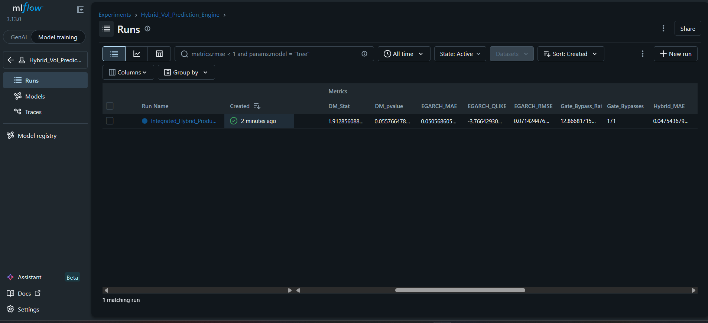

# S&P 500 Hybrid Volatility Engine: Risk-Gated Machine Learning

This is a quantitative research project exploring a core problem in financial machine learning: **ML models often achieve higher accuracy than traditional econometrics during calm markets, but extrapolate dangerously during Black Swan events.**

Rather than deploying a simple prediction backend, the primary goal of this project was to design a **mathematically defensible safety switch**. This pipeline uses a **SHAP Safety Gate** to monitor an XGBoost residual-correction model. If the market becomes anomalous, the gate safely disables the ML layer and falls back to a traditional econometric baseline (Student-t EGARCH).

---

## 1. The Original Project (Before the Audit)

Initially, this project was framed as a "Production Engine" evaluated on a single, static 3.5-year test split (Sep 2022 to Jun 2026). The original, un-audited metrics were:

| Model                      | RMSE    | MAE     | QLIKE    |
| -------------------------- | ------- | ------- | -------- |
| EGARCH(1,1,1) Base         | 0.06875 | 0.04868 | -2.04231 |
| Hybrid Final (Active Gate) | 0.06680 | 0.04598 | -2.04691 |

* **Original Lift:** +2.84% reduction in out-of-sample RMSE.
* **Original DM p-value:** 0.0002

---

## 2. The Self-Audit (How and Why things changed)

During a rigorous self-audit to prepare the codebase for quantitative review, I discovered critical mathematical flaws in the original pipeline that were artificially inflating performance. I refactored the entire project to enforce strict out-of-sample integrity.

### The Flaws Discovered:

1. **Target Leakage (Look-Ahead Bias):** The pandas `FixedForwardWindowIndexer` secretly included day *t*'s return in the target calculation. Because day *t*'s return was already known to the ML features, the model had a 20% look-ahead advantage.

2. **Train/Serve Skew:** The XGBoost model was trained on 1-day conditional variance errors (exact math), but tested on 5-day simulated forecast errors (Monte Carlo averages). The model was learning the wrong residual distribution.

3. **Weak Evaluation:** A static 3.5-year test set during a relatively calm market does not prove an ML model is robust.

### The Fixes Implemented:

1. **Target Isolation:** The target was strictly shifted to `[t+1 : t+5]`. The model now predicts a 100% unknown future (verified via `pytest`).

2. **Residual Alignment:** The training pipeline was rewritten to utilize seeded, 5-step Monte Carlo simulations via an expanding window, matching the inference environment perfectly.

3. **Walk-Forward Evaluation:** The evaluation was upgraded from a static split to a massive **14-year expanding-window walk-forward backtest (2012–2026)** to prove robustness across multiple distinct market cycles.

---

## 3. The True Results (After the Audit)

Removing the "cheating" leakage predictably lowered the theoretical lift. However, because the test was expanded to 14 years (3,644 days across 15 annual folds, encompassing the 2020 crash and 2022 inflation bear market), the corrected model is now mathematically bulletproof and highly significant over the long run.

| Model                          | RMSE        | MAE         | QLIKE        |
| ------------------------------ | ----------- | ----------- | ------------ |
| EGARCH(1,1,1) Base             | 0.07844     | 0.05272     | -3.90080     |
| **Hybrid Final (Active Gate)** | **0.07638** | **0.04953** | **-3.90314** |

* **True Performance Lift:** +2.63% sustained out-of-sample RMSE reduction over 14 years.
* **Diebold-Mariano p-value:** < 0.0001 (Statistically Superior)

---

## 4. The SHAP Safety Gate

Instead of trusting the ML blindly, the SHAP gate scales thresholds based on the VIX regime to check for Out-Of-Distribution (OOD) attributions and 21-day rank stability.

Without needing recalibration after the strict math fixes, the gate perfectly balanced risk during the walk-forward evaluation:

* **COVID-19 Crash:** Bypassed the ML model **65.48%** of the time.
* **Calm Markets (2017-2019):** Approved the ML model **93.77%** of the time.
* **Overall Intervention:** The gate intervened and shielded the portfolio on exactly **12.40%** of all trading days across 14 years.

---

## 5. MLflow Tracking

All metrics, parameters, and Diebold-Mariano tests are logged to an SQLite database.



*(Run `mlflow ui --backend-store-uri sqlite:///mlflow.db` locally to view the interactive dashboard)*

---

## 6. Reproducibility

The project is packaged via `pyproject.toml` and verified by `pytest` to mathematically guarantee zero target leakage.

```bash
# 1. Install dependencies
pip install -e .[dev]

# 2. Fetch data & engineer features
python scripts/run_pipeline.py

# 3. Run the 14-year Walk-Forward Evaluation
python scripts/run_walkforward_hybrid.py

# 4. Prove no target leakage via Unit Tests
pytest
```
